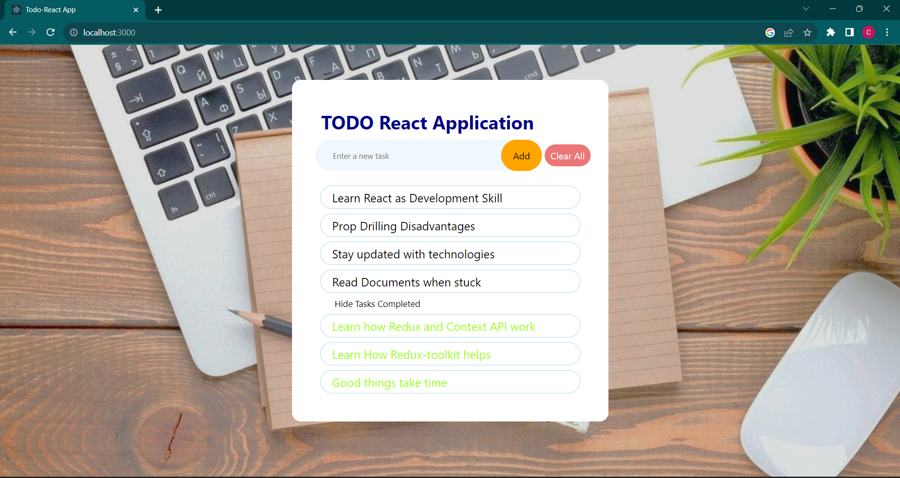

# React Todo Application

This is a simple React Todo Application built using functional components and Hooks, specifically `useState` and `useEffect`. The application also utilizes local storage to persist tasks so that they remain stored even after refreshing or closing the browser.



## Features

- Add new tasks
- Mark tasks as complete by clicking anywhere on the task
- Hide and unhide completed tasks
- Clear all tasks
- Alerts for edge cases, such as trying to delete all tasks or adding an empty task
- Task persistence using local storage

## Installation

To run this application locally, follow these steps:

1. Clone this repository to your local machine using the following command:

   ```bash
   git clone https://github.com/mehul-0/react-todo-app.git
   ```

2. Navigate to the project directory:

   ```bash
   cd react-todo-app
   ```

3. Install the required dependencies:

   ```bash
   npm install
   ```

4. Start the development server:

   ```bash
   npm start
   ```

5. Open your web browser and visit `http://localhost:3000` to use the application.

## Usage

1. To add a new task, simply type the task description in the input field and press Enter or click the "Add" button. An alert will appear if you try to add an empty task.

2. To mark a task as complete, click anywhere on the task. The task will be visually marked as complete.

3. To hide or unhide completed tasks, click the "Hide Completed" button. This will toggle the visibility of completed tasks.

4. To clear all tasks, click the "Clear All" button. An alert will appear to confirm this action. If you try to clear all tasks and there are no tasks, an alert will also notify you.

5. Your tasks will be saved in local storage, so you can close the browser and come back later to see your tasks still intact.

## Technologies Used

- React
- Functional Components
- React Hooks (`useState` and `useEffect`)
- Local Storage


Enjoy using the React Todo Application! If you have any questions or suggestions, feel free to open an issue or reach out to the project maintainers. Happy task management!